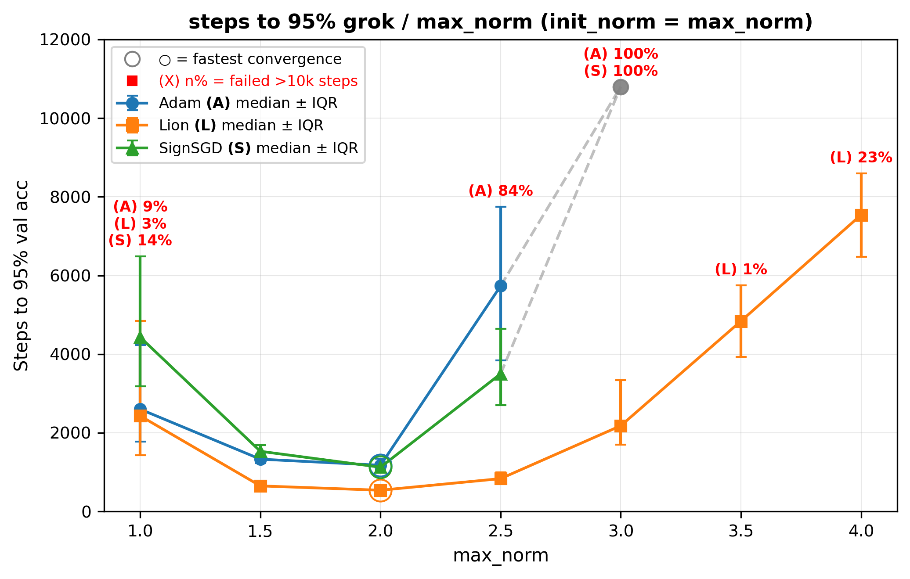
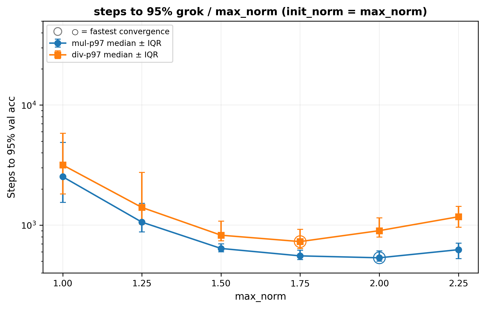
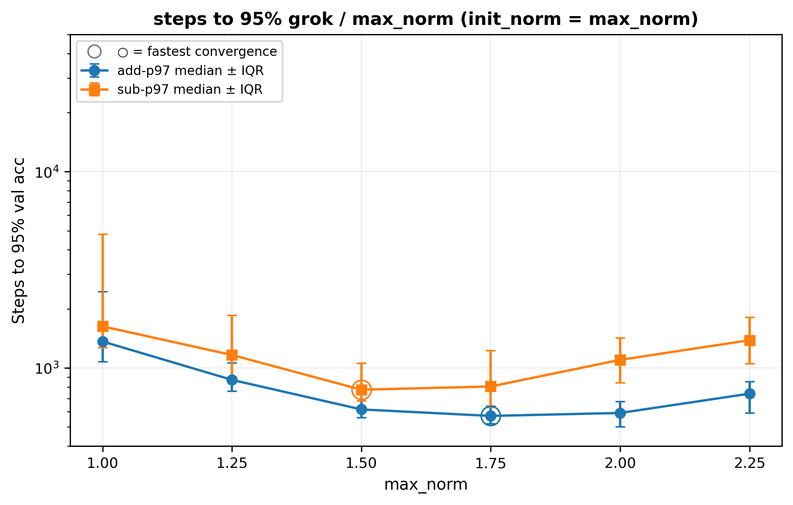
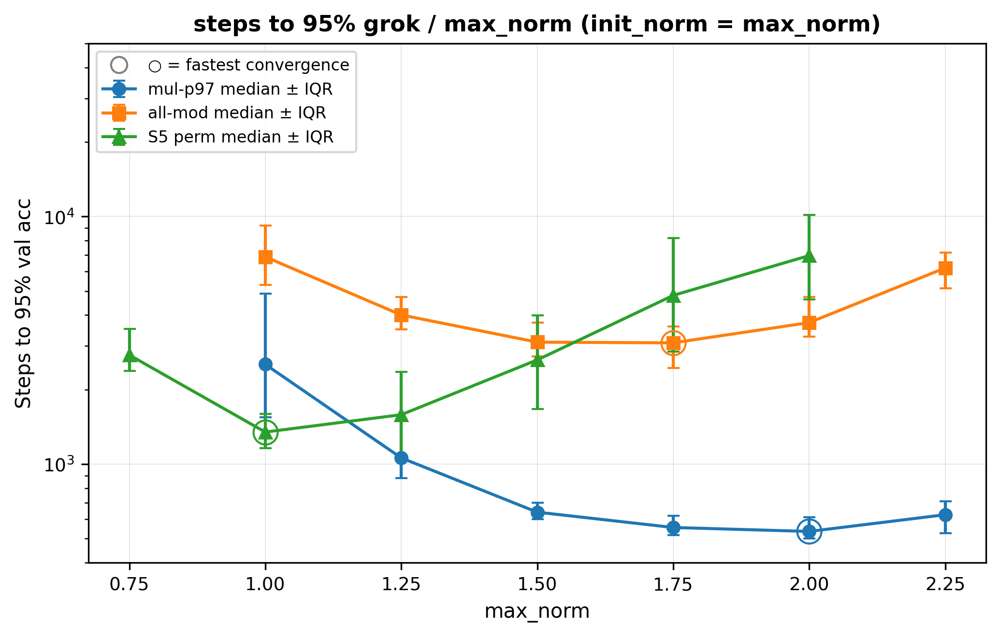
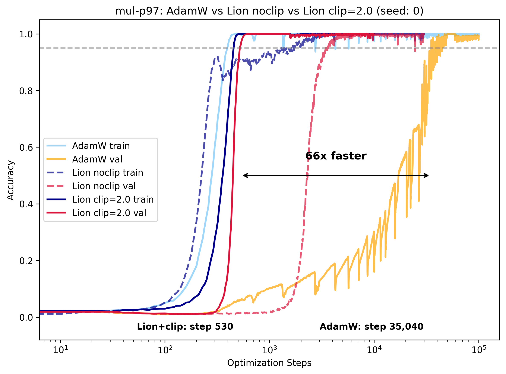
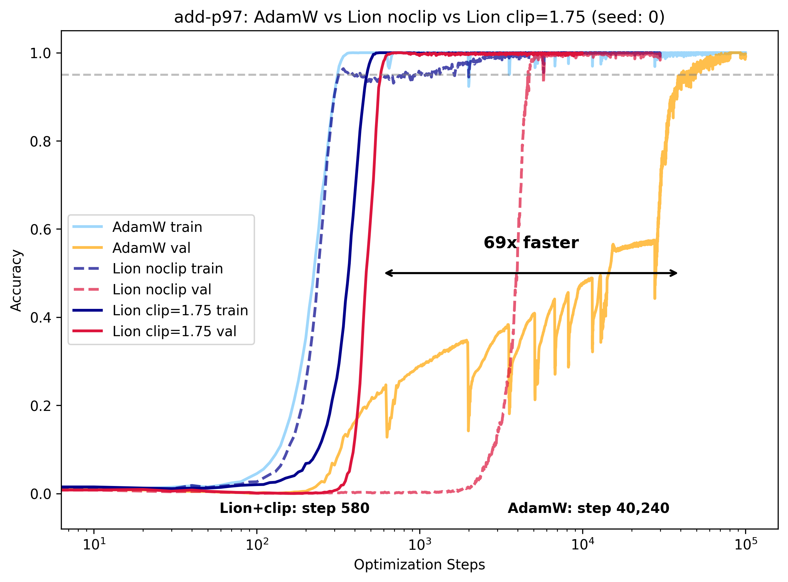
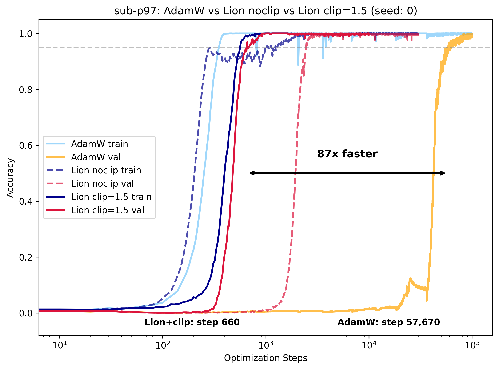
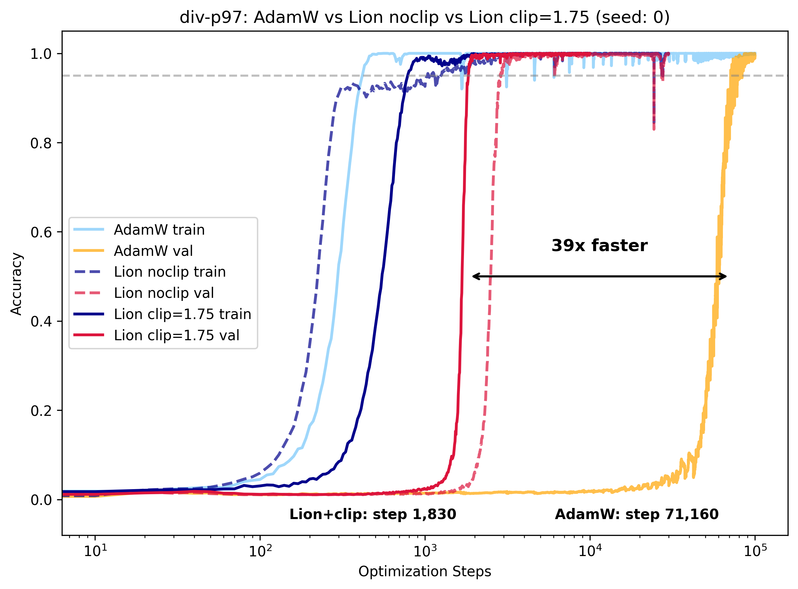
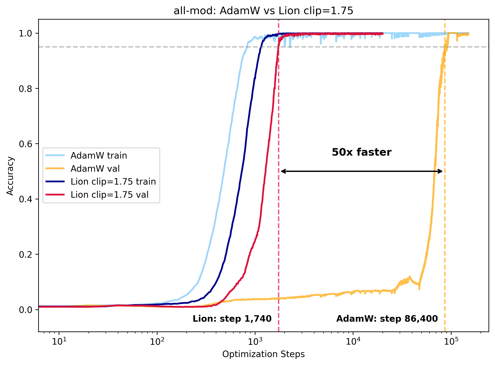
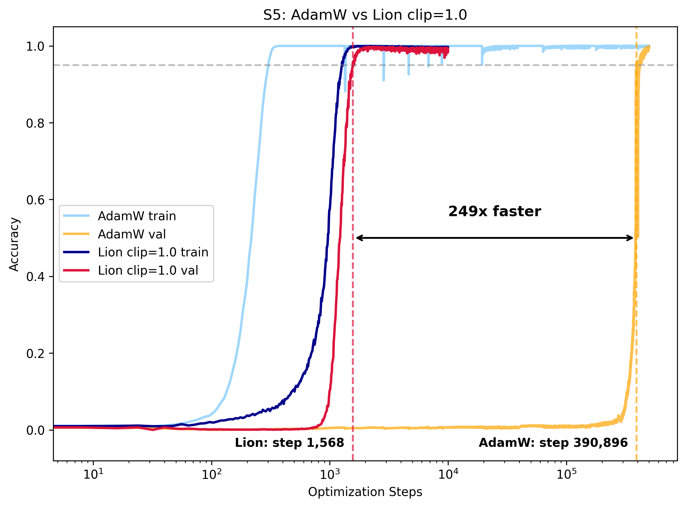

# Clip to Grok

Per-row weight norm clipping for accelerated generalization. Eliminates grokking delay without weight decay or gradient filtering.

---


*Single-seed demonstration on the 2-layer architecture (Lion, lr=10⁻³, init_norm=2.0, max_norm=2.0, β₁=0.9, β₂=0.97, 422k params). Training and validation converge together within ~1000 steps — no grokking delay. For 8-layer models, use init_pattern='edge_ln' instead.*

---

## Installation

```bash
pip install -r requirements.txt
```

```
# requirements.txt
torch==2.9.1+cu126
torchvision==0.24.1+cu126
lion-pytorch==0.2.3
tqdm==4.67.1
matplotlib==3.10.8
```

> The `cu126` build requires CUDA 12.6. For other CUDA versions, replace with the appropriate PyTorch build from [pytorch.org](https://pytorch.org/get-started/locally/).

`SignSGD` is included in the repo (`SignSGD.py`). No other non-standard dependencies.

---

## Quickstart

Preset scripts reproduce the exact paper configurations:

```bash
# Lion+Clip — each task at its optimal max_norm
python lion_clip_mul_p97.py
python lion_clip_add_p97.py
python lion_clip_sub_p97.py
python lion_clip_div_p97.py
python lion_clip_all_mod_p97.py
python lion_clip_s5_permutation.py

# AdamW baselines
python baseline_mul_p97.py
python baseline_add_p97.py
python baseline_sub_p97.py
python baseline_div_p97.py
python baseline_all_mod.py
python baseline_S5.py
```

For custom runs use `train.py` directly — see [CLI reference](#cli-reference) below.

---

## CLI reference

```
train.py arguments:

  --task            Task: add-p97 | sub-p97 | mul-p97 | div-p97 | all-mod | S5 (default: mul-p97)
  --budget          Total optimization steps (default: 2000)
  --batch_size      (default: 512)
  --weight_decay    (default: 0)
  --train_ratio     Train/val split fraction (default: 0.5)

  --dim             Model width (default: 128)
  --num_layers      (default: 2)
  --num_heads       (default: 4)

  --optimizer       Adam | AdamW | Lion | SignSGD (default: Lion)
  --lr              (default: 1e-3)
  --beta1           (default: 0.9)
  --beta2           (default: 0.97)

  --seed            (default: 0)
  --random_seed     Use random seed (flag)

  --init_pattern    all | edge | edge_ln (default: all)
  --init_norm       Normalize to this norm at init; 0 = disable (default: 2.0)
  --max_norm        Clip to this norm each step; 0 = disable (default: 2.0)

  --plot_progress   Show plots every 100 epochs (flag)
```

---

## Method

After each optimizer step, we project every weight row in the decoder layers onto the ℓ₂ ball of radius `max_norm`:

```
w_row ← w_row · min(1, max_norm / ‖w_row‖₂)
```

For modular multiplication, c=2.0 admits both shrinking (dot products < 1) and amplifying (dot products > 1) interactions between weight rows, enabling multiplicative dynamics while remaining bounded; c=1.0 restricts dot products to [−1, 1], limiting expressivity. Higher values (e.g., 4.0) weaken regularization. This is applied only to decoder layer weights (attention projections, MLP layers, and LayerNorm parameters); token embeddings and the output head are not clipped. No weight decay is used.

The method replaces weight decay — a single value requiring schedule tuning — with two decisions: `max_norm` (task-dependent; default 2.0 for modular multiplication, varies by task — see [Task-dependent max\_norm](#task-dependent-max_norm--single-modular-arithmetic-tasks-lion-2-layer-n100)) and an initialization pattern (`all` for shallow models, `edge_ln` for deep). Neither requires per-run tuning within a task: `max_norm` is fixed across all optimizers, architectures, and learning rates tested for a given task; the init pattern is determined by depth alone. In exchange, weight decay and its schedule are eliminated entirely.

### Training loop

`clip_weight_norms` is called after each `optimizer.step()`. `project_to_sphere` is called once at initialization for edge init.

```python
for input in dataloader:
    loss.backward()
    optimizer.step()
    scheduler.step()

    with torch.no_grad():
        clip_weight_norms(model, max_norm=2.0)
```

### Core functions (`norms.py`)

```python
def project_to_sphere(model, max_norm=2.0, norm_patterns=['token_embeddings', 'ln_f', 'head']):
    """One-time init. All matched rows get exactly max_norm — normalized, not clipped.
    Pass norm_patterns=['*'] to normalize all parameters."""
    for name, param in model.named_parameters():
        if '*' in norm_patterns or any(p in name for p in norm_patterns):
            norm = param.norm(dim=-1, keepdim=True).clamp(min=1e-8)
            param.mul_(max_norm / norm)

def clip_weight_norms(model, max_norm=2.0, skip_patterns=['token_embeddings', 'head']):
    """Post-step. Clips rows exceeding max_norm; rows below threshold unchanged."""
    for name, param in model.named_parameters():
        if any(p in name for p in skip_patterns):
            continue
        norm = param.norm(dim=-1, keepdim=True).clamp(min=1e-8)
        param.mul_(torch.clamp(norm, max=max_norm) / norm)
```

### Layer coverage

| Layer type | Shallow (`all`) Init | Shallow Clip | Deep (`edge_ln`) Init | Deep Clip |
|---|---|---|---|---|
| Token embeddings | ✓ (to c) | — | ✓ (to c) | — |
| Decoder layers | ✓ (to c) | ✓ (≤ c) | — (Kaiming) | ✓ (≤ c) |
| Final LayerNorm | ✓ (to c) | ✓ (≤ c) | ✓ (to c) | ✓ (≤ c) |
| Output head | ✓ (to c) | — | ✓ (to c) | — |

Decoder layers are clipped every step to prevent memorization shortcuts. Embeddings and head are not clipped — cross-entropy requires unconstrained logit magnitudes — but are initialized to `c` so the network begins at consistent scale. The final LayerNorm (`ln_f`) sits between the last decoder layer and the output head; initializing it to `c` ensures stable gradient flow at this boundary. In shallow models, initializing all layers to `c` eliminates seed variance entirely. In deep models, this inflates residual contributions exponentially (α^L), so only the boundary layers are touched — hence "edge" initialization.

### Initialization patterns

Three options for `--init_pattern`:

| Pattern | Layers normalized | Use case |
|---|---|---|
| `all` | All parameters (`['*']`) | Shallow models (L ≤ 3) |
| `edge_ln` | `token_embeddings`, `ln_f`, `head` | Deep models (L ≥ 4) — **recommended** |
| `edge` | `token_embeddings`, `head` | Excludes final LayerNorm |

**Why not `all` for deep models?** `all` initialization fails on 8-layer models. The α^L scaling law motivates why: for a purely homogeneous L-layer network, scaling all weights to `c` inflates output by (c/‖w_init‖)^L — at L=8 with c=2.0 that is ~13,000×. Our transformer uses residual connections and LayerNorm so this does not directly apply, but the same pressure drives instability in practice. `edge_ln` leaves internal decoder layers at Kaiming scale and only normalizes the boundary layers. See [Why it works → α^L depth scaling](#why-it-works) for the full analysis.

**Why `init_norm` must match `max_norm` for Lion.** Adaptive optimizers (Adam) tolerate imprecise initialization: Adam's per-parameter second moment compensates for scale mismatch, so any normalization eliminates failures. Sign-based optimizers require matched initialization. At `init_norm=1.0` with `max_norm=2.0`, Lion's IQR *worsens* (865 → 1010) — weights must grow from 1.0 toward the clipping boundary before clipping engages, creating a transient regime. At `init_norm=2.0`, all layers begin at the boundary and clipping engages immediately.

---

## Results

Speedups computed against the AdamW baseline (no clipping, wd=0.01): 2-layer median 35,040 steps; 8-layer median 28,905 steps.

### Baseline vs. Grokfast vs. Clip


*Training and validation accuracy on modular multiplication (p=97, 2-layer), each method at its best reported configuration. Baseline (AdamW, wd=0.01) reaches 95% val at step 35,040. Grokfast (Adam + MA filter, window=100, λ=5.0, wd=0.01) at step 780. Lion+Clip (max_norm=2.0, wd=0) at step 530 — a 66× speedup over baseline and 1.5× over Grokfast. Note: Grokfast also uses a different optimizer (Adam) than the AdamW baseline; our comparison follows the same best-configuration convention.*

**Decomposing the speedup.** The 66× headline uses Lion, not Adam. To separate optimizer and method contributions: Adam+Clip reaches a 2-layer median of 1,200 steps (over 200 seeds) — slower than Grokfast's single-run 780, but note these are not directly comparable: Grokfast's 780 is a single seed; Adam+Clip's 1,200 is a median over 200 seeds with zero failures. The additional speedup to 550 steps comes from combining clipping with a sign-based optimizer. This decomposition is consistent across scales: on 8-layer models, Adam+Clip alone provides ~11× speedup over baseline, while Lion+Clip reaches 18×.

> **Note on step counts.** "Lion+Clip, 2-layer, mul-p97" appears with three values: **530** (single seed, Grokfast comparison — seed 0), **540** (n=100 median, max\_norm ablation), **550** (n=200 median, seed stability table). All are the same configuration; the differences reflect single-seed variance vs. seeded medians over different run counts. **Quote 550 for reproducibility claims.** The single-seed 530 is reported for direct comparison against Grokfast's single-run figure, following the same convention.

### 2-layer seed stability (mul-p97, max\_norm=2.0, n=200)

Table reports convergence across 100–200 seeds, sweeping `init_norm` with fixed `max_norm=2.0`. All use lr=1e-3, wd=0. Budget: 5,000 steps. 95% CIs via bootstrap resampling (B=10,000).

| Optimizer | Median [95% CI] | IQR | P95 | Failures |
|---|---|---|---|---|
| Lion+Clip | **550 [530–560]** | **110** | 780 | **0** |
| Adam+Clip | 1,200 [1,160–1,245] | 285 | 1,792 | 0 |
| SignSGD+Clip | 1,140 [1,110–1,165] | 180 | 1,420 | 0 |

At `init_norm=2.0`, all seeds across all three optimizers converge within 5,000 steps with zero failures. Without normalization, 10% of Adam seeds and isolated Lion/SignSGD seeds exhibit delayed grokking. Lion achieves the fastest median (550 steps) with the tightest IQR (110), demonstrating particular synergy between sign-based updates and norm clipping.


*Multi-seed accuracy on the 2-layer architecture (init_norm=2.0, max_norm=2.0, n=200). Dashed lines mark median steps to 95% val accuracy: Adam 1,200, Lion 550, SignSGD 1,140. All seeds converge within 5,000 steps with zero failures.*

### Data-scarce regime (25/75 split)

The 25/75 train/validation split is a strictly harder setting: the model sees 25% of the data and must generalize to the remaining 75%. Under this split, Adam+Clip exhibits loss spikes and SignSGD fails to generalize within budget. Lion+Clip is the only configuration that converges reliably across seeds.


*Multi-seed accuracy with 25/75 train/val split (2-layer, Lion, lr=10⁻³, init_norm=2.0, max_norm=2.0, wd=0, n=200). Dashed line: median 95% val accuracy at step 1,530. All seeds converge within 10,000 steps. Adam and SignSGD struggle under this split (not shown); Lion's momentum provides the directional consistency needed when fewer training examples are available per step.*

The median convergence (1,530 steps) is roughly 3× slower than the 50/50 split (550 steps), consistent with the reduced training set rather than any failure of the method. That Lion alone succeeds here reinforces the synergy between sign-based updates with momentum and norm clipping: bounded weights prevent memorization shortcuts, while momentum provides the gradient signal averaging that compensates for the smaller training set.

### 8-layer edge initialization (max\_norm=2.0, n=100)

Without clipping, 8-layer training exhibits Softmax Collapse. Validation loss spikes 10–30× above initial values as floating-point errors accumulate, while validation accuracy spreads across two orders of magnitude in convergence time.

<table>
<tr>
<td><br/><em>Loss (8-layer AdamW, n=100). Median val loss peaks at ~10 after step ~10³; individual seeds spike to 30.</em></td>
<td><br/><em>Accuracy (n=100). Train memorizes by step 300; val convergence spreads from 10³ to 5×10⁴ steps.</em></td>
</tr>
</table>

Edge initialization (`edge_ln`) uniformly improves all metrics across all three optimizers. LRs: Lion 1e-4; Adam, SignSGD 2e-4. wd=0. Budget: 50,000 steps. 95% CIs via bootstrap resampling (B=10,000).

| Optimizer | Init | Median [95% CI] | IQR | P95 | Failures | Speedup |
|---|---|---|---|---|---|---|
| Lion | None | 2,230 [2,050–2,330] | 832 | 3,620 | 0 | — |
| Lion | **edge_ln** | **1,570 [1,540–1,630]** | **285** | **2,430** | **0** | **18×** |
| Adam | None | 3,970 [3,660–4,360] | 1,480 | 6,747 | 1 | — |
| Adam | **edge_ln** | **2,675 [2,620–2,765]** | **412** | **3,292** | **0** | ~11× |
| SignSGD | None | 4,245 [3,930–4,470] | 1,838 | 8,288 | 4 | — |
| SignSGD | **edge_ln** | **2,900 [2,800–3,020]** | **720** | **3,955** | **0** | ~10× |
| AdamW (no clip) | — | 28,905 [25,050–31,215] | 12,475 | 37,197 | 0 | — |

IQR reduction: 66% (Lion), 72% (Adam), 61% (SignSGD). Zero failures across all 300 edge-init runs. The baseline IQR of 12,475 — 43× Lion's 285 — shows standard training suffers extreme seed variance.


*Multi-seed accuracy (8-layer, edge_ln init, max_norm=2.0, wd=0, n=100 per optimizer). Dashed lines: median steps to 95% val acc. Adam: 2,675, Lion: 1,570, SignSGD: 2,910. All show near-simultaneous train/val convergence with zero failures.*

### Scale robustness

At the lower extreme, a 9.8k parameter model (2 layers, dim=16, 4 heads) fails to train without clipping: AdamW at lr=10⁻³ does not converge, and lr=10⁻² produces unstable grokking around 3,000 steps. With clipping (max_norm=2.0), both Adam and Lion converge cleanly within 2,000 steps at lr=5×10⁻³. The method thus spans two orders of magnitude in model size (9.8k–1.6M parameters) without modification.

| Model | Params | Without clipping | With clipping |
|---|---|---|---|
| Tiny | 9.8k | Fails to converge | ✓ <2,000 steps |
| Small | 422k | ~35,040 steps (baseline) | 550 steps (Lion) |
| Medium | 1.6M | ~28,905 steps (baseline) | 1,570 steps (Lion) |

### max\_norm selection — mul-p97 (2-layer, n=100 per cell)

All three optimizers converge on max\_norm=2.0 as optimal for modular multiplication. Below this value, the constraint is too tight — dot products between weight rows are restricted to [−1, 1], limiting the multiplicative dynamics needed for Fourier circuits. Above 2.0, regularization weakens: Adam and SignSGD fail entirely at 3.0; Lion degrades gracefully but still slows 4× at 2.5. Superscripts indicate failure rate (>10k steps).

| Optimizer | 1.0 | 1.5 | **2.0** | 2.5 | 3.0 |
|---|---|---|---|---|---|
| Lion | 2,430 [1,960–2,900]³% | 650 [630–700] | **540 [529–570]** | 835 [800–900] | 2,180 [1,980–2,540] |
| Adam | 2,600 [2,240–3,020]⁹% | 1,330 [1,290–1,370] | **1,175 [1,130–1,235]** | 5,735 [3,890–7,530]⁸⁴% | 100% fail |
| SignSGD | 4,430 [3,765–5,285]¹⁴% | 1,530 [1,440–1,590] | **1,125 [1,100–1,165]** | 3,500 [3,250–3,790] | 100% fail |


*Steps to 95% val acc vs. max_norm on modular multiplication (2-layer, n=100 per optimizer). Circles mark fastest convergence; red annotations show failure rates. The optimal value is 2.0 for all three optimizers, with a sharp failure cliff for Adam and SignSGD above 2.5.*

### Task-dependent max\_norm — single modular arithmetic tasks (Lion, 2-layer, n=100)

The optimal max\_norm for modular multiplication (2.0) does not transfer to all tasks. Division and subtraction (which require modular inversion) favor 1.5–1.75; multiplication and addition tolerate 1.75–2.0. The pooled average across the four operations confirms the trend — optimal at 1.75 (630 steps) with a shallow basin from 1.5 to 2.0.

| max\_norm | add-p97 | sub-p97 | mul-p97 | div-p97 | avg |
|---|---|---|---|---|---|
| no-clip | 2,525 [2,340–2,715] | 3,160 [2,940–3,480] | 2,865 [2,650–3,140] | 3,740 [3,375–4,230] | 3,025 [2,860–3,160] |
| 1.0 | 1,365 [1,190–1,575] | 1,630 [1,430–2,015] | 2,530 [2,100–3,010] | 3,170 [2,700–4,270] | 2,055 [1,784–2,450] |
| 1.25 | 870 [820–925] | 1,165 [1,020–1,260] | 1,060 [999–1,240] | 1,405 [1,195–1,695] | 1,065 [1,020–1,145] |
| 1.5 | 615 [590–660] | **775 [740–870]** | 640 [625–660] | 825 [790–870] | 720 [690–740] |
| 1.75 | **570 [555–590]** | 805 [690–970] | 555 [545–580] | **730 [700–790]** | **630 [620–650]** |
| 2.0 | 590 [555–620] | 1,100 [955–1,220] | **535 [520–560]** | 900 [860–950] | 705 [660–750] |
| 2.25 | 740 [680–790] | 1,385 [1,250–1,550] | 625 [590–650] | 1,175 [1,045–1,225] | 910 [869–960] |

<table>
<tr>
<td><br/><em>mul-p97 vs. div-p97. Both U-shaped; div shifts left (optimal 1.75 vs. 2.0).</em></td>
<td><br/><em>add-p97 vs. sub-p97. add optimal at 1.75; sub at 1.5.</em></td>
</tr>
</table>

### Multi-task and non-abelian tasks (Lion, 2-layer, n=100)

S5 is sharply optimal at 1.0 and degrades rapidly above 1.25 — much tighter than the abelian tasks. For all-mod, 1.75 is nominally best but the CIs overlap substantially with 1.5 (3,110 [3,010–3,300] vs. 3,090 [2,880–3,300]); treat the basin as flat from 1.5 to 1.75.

| max\_norm | all-mod | S5 perm |
|---|---|---|
| 0.75 | — | 2,760 [2,644–2,952] |
| 1.0 | 6,875 [6,385–7,685] | **1,348 [1,252–1,424]** |
| 1.25 | 4,005 [3,860–4,100] | 1,584 [1,432–1,872] |
| 1.5 | 3,110 [3,010–3,300] | 2,636 [2,216–2,928] |
| 1.75 | **3,090 [2,880–3,300]** | 4,804 [4,120–5,580] |
| 2.0 | 3,730 [3,600–3,970] | 6,956 [6,184–7,664] |


*mul-p97 vs. all-mod vs. S5. S5 is sharply optimal at 1.0 and degrades rapidly above 1.25; mul-p97 improves monotonically up to 2.0. The multi-task all-mod shows intermediate behavior.*

### Cross-task speedups (Lion+Clip vs. AdamW baseline, single seed)

Single-seed results following the best-configuration convention of Lee et al. (Grokfast, 2024); seeded medians in Tables 1–2 confirm consistency for mul-p97 (single-seed 530 vs. seeded median 550).

| Task | max_norm | Lion+Clip Steps | AdamW Steps | Speedup |
|---|---|---|---|---|
| mul-p97 | 2.0 | 530 | 35,040 | **66×** |
| add-p97 | 1.75 | 580 | 40,240 | **69×** |
| sub-p97 | 1.5 | 660 | 57,670 | **87×** |
| div-p97 | 1.75 | 1,830 | 71,160 | **39×** |
| all-mod | 1.75 | 1,740 | 86,400 | **50×** |
| S5 perm | 1.0 | 1,568 | 390,896 | **249×** |

Speedups range from 39× (div) to 249× (S5). In every case, Lion+Clip shows near-simultaneous train/val convergence, while the AdamW baseline exhibits the characteristic memorize-then-generalize gap with post-memorization instability. Notably, Lion without clipping (wd=0) fails entirely on the harder tasks: S5 groks but then diverges as weights explode, and all-mod never converges. For complex algebraic structures, norm control is not merely an acceleration technique — it is necessary for stable generalization when weight decay is absent.

<table>
<tr>
<td><br/><em>mul-p97 (max_norm=2.0): 66× speedup</em></td>
<td><br/><em>add-p97 (max_norm=1.75): 69× speedup</em></td>
</tr>
<tr>
<td><br/><em>sub-p97 (max_norm=1.5): 87× speedup</em></td>
<td><br/><em>div-p97 (max_norm=1.75): 39× speedup</em></td>
</tr>
<tr>
<td><br/><em>all-mod (max_norm=1.75): 50× speedup</em></td>
<td><br/><em>S5 permutation (max_norm=1.0): 249× speedup</em></td>
</tr>
</table>

### Lion learning rate tolerance

**Setup.** 20 LRs log-spaced 10⁻⁴ to 4×10⁻³, 40 seeds per LR, wd=0 (apples-to-apples).


*LR tolerance: Lion+Clip (solid) vs. Lion no-clip (dashed), 40 seeds/LR, wd=0. Three accuracy thresholds shown (50%, 80%, 95%). Clipping provides 3–6× speedup at every LR with compressed variance. Red percentages and gray dots indicate no-clip failure rates at high LR (35%, 60%, 100%). Clipped runs show only 2.5% failure at LR=4×10⁻³.*

With clipping: clean U-curve, optimal LR ~10⁻³, median ~530 steps, usable band spanning a full decade. 5 failures out of ~800 runs. Without clipping: 3–6× slower at every LR. At LR=10⁻⁴: 14,000 steps (5.4× slower). Error bars 3–5× wider.

**Generalization crispness.** Under clipping, the 50/80/95% thresholds are reached within ~200–500 steps of each other. Without clipping, the gap spans 4,000–7,000 steps — a prolonged, stochastic transition.

**Interpretation.** Clipping decouples LR from escape risk. LR controls exploration speed *within* the bounded weight set, not the risk of norm explosion — explaining the 3–6× uniform speedup.

### Validated learning rates

**No weight decay.** Default is `--weight_decay 0`.

| Optimizer | 2-layer | 8-layer |
|---|---|---|
| Lion (β₁=0.9, β₂=0.97) | 1e-3 | 1e-4 |
| Adam | 1e-3 | 2e-4 |
| SignSGD | 1e-3 | 2e-4 |

---

## Why it works

We analyze why weight norm clipping accelerates generalization through four complementary lenses. Each established framework independently predicts that bounding weight norms should help; clipping implements this directly.

**1. Omnigrok timescale collapse**

The grokking timescale depends on how far initialization `w₀` lies from `wc`: `t_grok ≈ (1/γ) · ln(w₀/wc)`, where γ is the weight decay rate. Weight norm clipping eliminates this delay by constraining `‖w‖ ≤ c` at every step. If `c ≈ wc`, then `ln(w₀/wc) → 0` and the grokking timescale collapses regardless of γ. Two consequences: (1) weight decay becomes unnecessary — clipping keeps norms in the zone from the start; (2) robustness to exact `c` — the method works with `max_norm=2.0` across all tested configurations without tuning, suggesting the Goldilocks zone is broad relative to the clipping threshold.

**2. α^L depth scaling**

For a purely homogeneous L-layer network (no residual connections, no LayerNorm), scaling all weights to `init_norm=c` inflates each layer by `α = c/‖w_init‖`: output scale ∝ (c/‖w_init‖)^L. For `c=2.0` and Kaiming init (`‖w‖ ≈ 0.6`): at L=2, α^L ≈ 11; at L=8, α^L ≈ 13,000. Our transformer uses residual connections and LayerNorm, so this homogeneous analysis does not directly apply. However, it motivates why `init_norm=2.0` on all layers improves 2-layer but harms 8-layer models. In residual networks, skip connections convert the exponential α^L risk into bounded linear perturbation L·c, explaining why the same `max_norm=2.0` works across depths with edge initialization.

**3. Sign-based optimizers and norm clipping**

Lion's update is `sign(mₜ)`: each parameter changes by exactly ±lr per step, regardless of gradient magnitude. Without norm control, this uniform step size means weight norms grow linearly in training steps. Clipping caps this growth, preventing the slow drift toward Softmax Collapse. The combination — bounded updates from the sign operation, bounded norms from clipping — keeps optimization stable across a wide LR range: 3–6× speedup at every tested LR with 0% failures up to LR=2×10⁻³, versus 100% failure without clipping at the same LR.

**4. Softmax Collapse prevention**

After memorization, the training objective (negative log-likelihood) can still decrease by increasing logit magnitudes, which requires growing weight norms. This post-memorization weight growth drives logit amplification until float32 overflow causes absorption errors in softmax, producing erratic gradients that stall generalization. Clipping eliminates this cascade by bounding decoder norms: `‖w_row‖₂ ≤ c` directly caps logit growth proportional to `c`, preventing overflow regardless of training duration.

**Observation: Grokfast + Adam → approximately sign-based updates**

Grokfast amplifies slow-varying gradient components via an EMA filter, then feeds the modified gradient into Adam. Adam's second-moment normalization divides each parameter's update by its own RMS, driving updates toward ±1. This effect is amplified when Grokfast's EMA filter smooths the gradient signal (reducing variance within the second-moment estimate). The resulting effective update — sign of a momentum-weighted gradient — resembles Lion's update rule. Put differently: Grokfast applies momentum at the gradient level; Lion applies it at the optimizer level. Both produce sign-based, directionally consistent updates. This is an informal observation, not a proof — it depends on Adam's moment estimates being well-conditioned and Grokfast's λ being large enough to dominate the raw gradient. We note it because it may explain why both methods achieve comparable speedups despite different mechanisms, and because it suggests that the grokking acceleration literature may have been converging on sign-based dynamics from multiple directions independently.

---

## Optional: Head clipping for Lion

After reaching 95%+ validation accuracy, Lion can exhibit minor val oscillations driven by unbounded head norm growth. Optionally applying a loose secondary clip suppresses this without affecting convergence speed. **Use with Lion only** — Adam's second-moment statistics conflict with external norm constraints on the head, producing worse oscillations rather than better. This is an empirical observation from the paper's LR stability experiments; there is no dedicated ablation.

```python
# Use with Lion only — call this immediately after clip_weight_norms(..)
with torch.no_grad():
    clip_weight_norms(model, max_norm=24.0, skip_patterns=[])
```

Since 24.0 >> 2.0, this won't touch anything the primary clip is already managing. It only acts on layers left unconstrained by the primary clip — head and embeddings — if their norms have drifted into problematic territory.