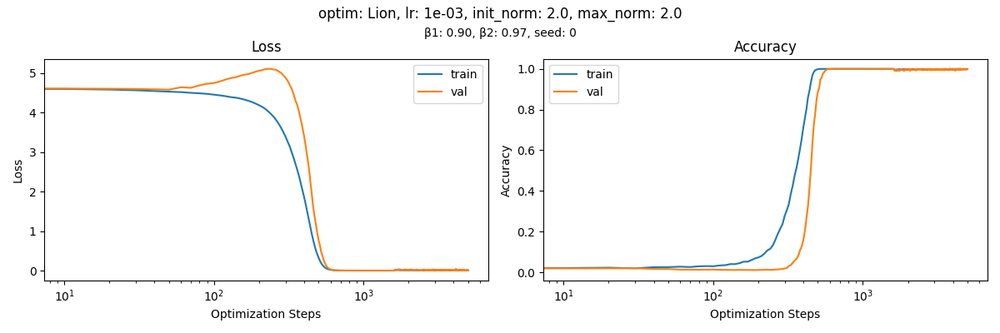
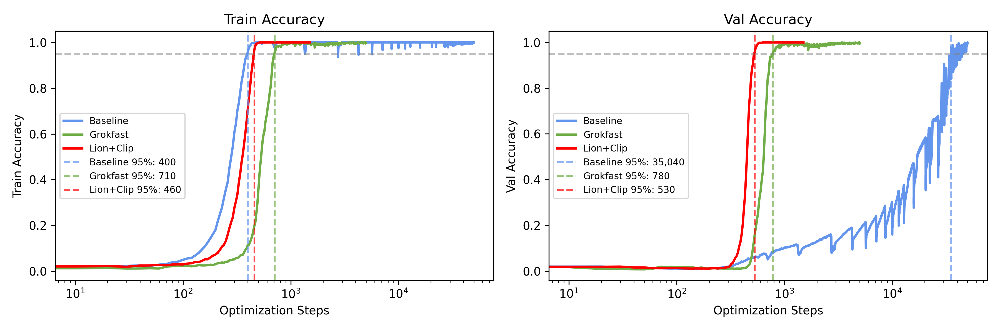
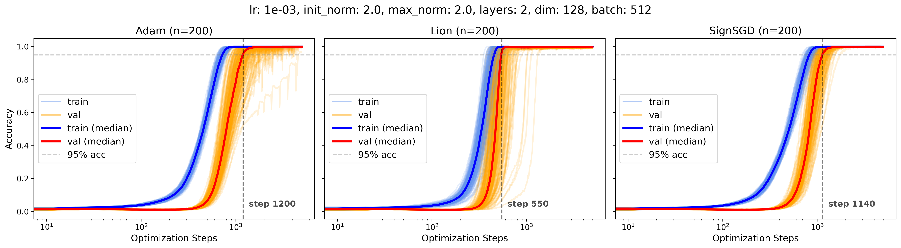
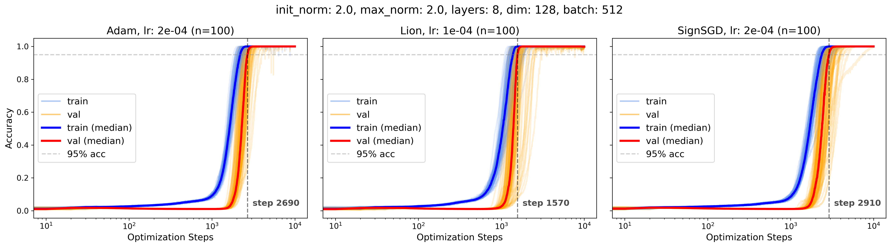
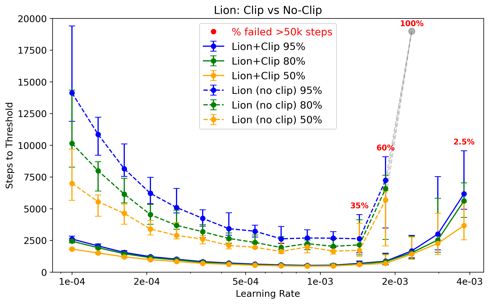
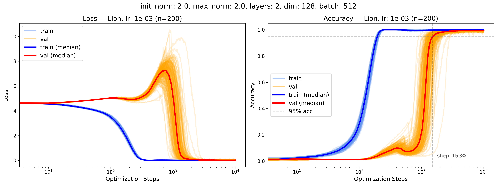
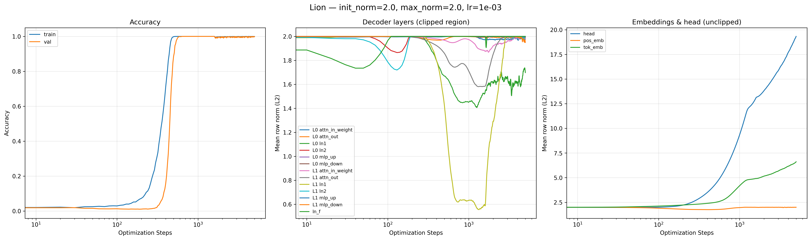
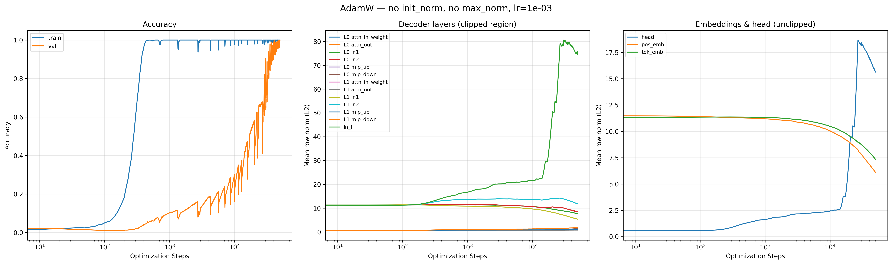
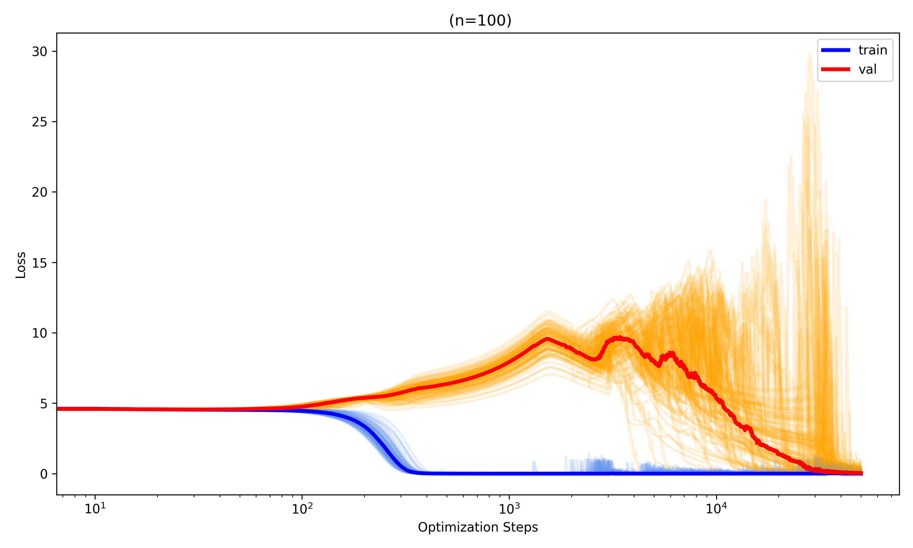
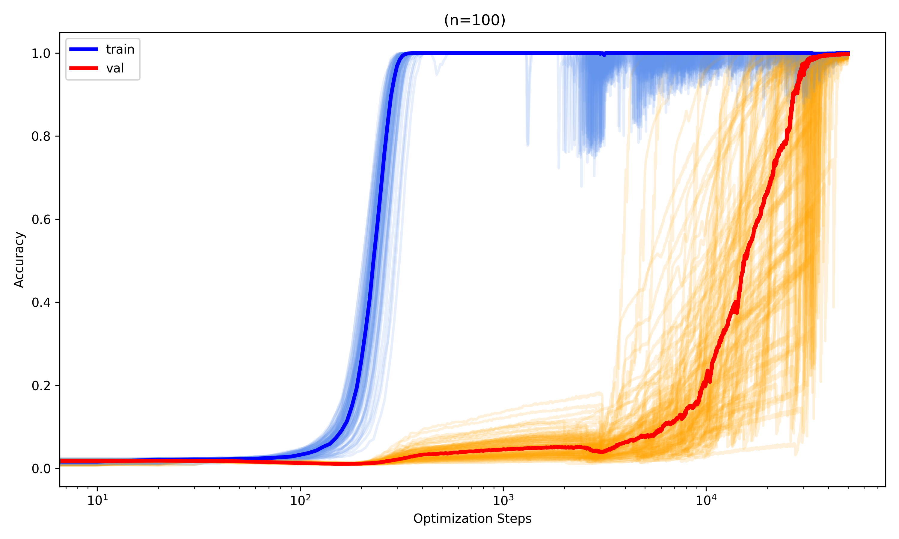

# Clip to Grok

Per-row weight norm clipping for accelerated generalization. Eliminates grokking delay without weight decay, gradient filtering, or optimizer-specific tuning.

---


*Lion+Clip on 2-layer model — no grokking delay. Train and val converge together within ~1000 steps.*

---

## Results

Speedups computed against the AdamW baseline (no clipping, wd=0.01): 2-layer median 35,040 steps; 8-layer median 28,905 steps.

| Architecture | Optimizer | Median Steps | Speedup vs. Baseline |
|---|---|---|---|
| 2-layer, 422k params | Lion+Clip | 550 | **66×** |
| 2-layer, 422k params | Adam+Clip | 1,200 | ~29× |
| 2-layer, 422k params | SignSGD+Clip | 1,140 | ~31× |
| 2-layer, 422k params | AdamW baseline | 35,040 | — |
| 8-layer, 1.6M params | Lion+Clip | 1,570 | **18×** |
| 8-layer, 1.6M params | Adam+Clip | 2,690 | ~11× |
| 8-layer, 1.6M params | SignSGD+Clip | 2,910 | ~10× |
| 8-layer, 1.6M params | AdamW baseline | 28,905 | — |

Zero failures across all 300 edge-init runs on 8-layer models. IQR reduced by 61–72%.

### Baseline vs. Grokfast vs. Clip


*Baseline reaches 95% val at step 35,040. Grokfast at 780. Lion+Clip at 530 — 66× speedup.*

### Seed stability (2-layer)


*All 200 seeds converge within 5,000 steps with zero failures at init_norm=2.0.*

### Seed stability (8-layer, edge_ln init)


*Zero failures across all 300 runs. Near-simultaneous train/val convergence.*

### Lion learning rate tolerance


*Clipping provides 3–6× speedup at every LR with compressed variance. Usable band spans a full decade.*

### 25/75 data-scarce regime (Lion only)


*Lion+Clip is the only configuration that converges reliably under the harder 25/75 split.*

---

## Installation

```bash
pip install -r requirements.txt
```

```
# requirements.txt
torch==2.9.1+cu126
torchvision==0.24.1+cu126
lion-pytorch==0.2.3
tqdm==4.67.1
matplotlib==3.10.8
```

`SignSGD` is included in the repo (`SignSGD.py`). No other non-standard dependencies.

---

## Quickstart

**Lion+Clip (mul-p97, 2-layer):**
```bash
python train.py --task mul-p97 --optimizer Lion --lr 1e-3 --init_norm 2.0 --max_norm 2.0 --init_pattern all
```

**Other tasks (norm varies by task difficulty):**
```bash
python train.py --task add-p97 --optimizer Lion --lr 1e-3 --init_norm 1.75 --max_norm 1.75
python train.py --task sub-p97 --optimizer Lion --lr 1e-3 --init_norm 1.5 --max_norm 1.5
python train.py --task div-p97 --optimizer Lion --lr 1e-3 --init_norm 1.75 --max_norm 1.75
python train.py --task all-mod --optimizer Lion --lr 1e-3 --init_norm 1.75 --max_norm 1.75 --batch_size 2048
python train.py --task S5 --optimizer Lion --lr 1e-3 --init_norm 1.0 --max_norm 1.0 --batch_size 2048
```

**8-layer:**
```bash
python train.py --task mul-p97 --optimizer Lion --lr 1e-4 --num_layers 8 --init_norm 2.0 --max_norm 2.0 --init_pattern edge_ln
```

**Baseline (no clipping, AdamW):**
```bash
python train.py --task mul-p97 --optimizer AdamW --lr 1e-3 --weight_decay 0.01 --init_norm 0 --max_norm 0
```

---

## Method

After each optimizer step, clip every weight row in the decoder layers to the ℓ₂ ball of radius `max_norm`:

```
w_row ← w_row · min(1, max_norm / ‖w_row‖₂)
```

Applied to all decoder layer weights (attention projections, MLP, LayerNorm). Embeddings and output head are skipped — cross-entropy requires unconstrained logit magnitudes. No weight decay.

### Training loop (actual)

Clipping happens **inside the batch loop**, after each optimizer step:

```python
for input in dataloader:
    loss.backward()
    optimizer.step()
    scheduler.step()

    with torch.no_grad():
        clip_weight_norms(model, max_norm=2.0)
```

### Core functions (`norms.py`)

```python
def project_to_sphere(model, max_norm=2.0, norm_patterns=['token_embeddings', 'ln_f', 'head']):
    """One-time init. All matched rows get exactly max_norm — normalized, not clipped.
    Pass norm_patterns=['*'] to normalize all parameters."""
    for name, param in model.named_parameters():
        if '*' in norm_patterns or any(p in name for p in norm_patterns):
            norm = param.norm(dim=-1, keepdim=True).clamp(min=1e-8)
            param.mul_(max_norm / norm)

def clip_weight_norms(model, max_norm=2.0, skip_patterns=['token_embeddings', 'head']):
    """Post-step. Clips rows exceeding max_norm; rows below threshold unchanged."""
    for name, param in model.named_parameters():
        if any(p in name for p in skip_patterns):
            continue
        norm = param.norm(dim=-1, keepdim=True).clamp(min=1e-8)
        param.mul_(torch.clamp(norm, max=max_norm) / norm)
```

---

## Hyperparameters

Two decisions: `max_norm` (task-dependent) and `init_pattern` (depth-dependent).

### Task-specific norms

Optimal norm scales inversely with task difficulty. Symmetric operations (add, mul) are easier than asymmetric (sub, div). S5 permutation is hardest.

| Task | max_norm | Median Steps (n=100) | Notes |
|---|---|---|---|
| mul-p97 | 2.0 | 535 | Symmetric, easiest |
| add-p97 | 1.75 | 570 | Symmetric |
| div-p97 | 1.75 | 730 | Asymmetric |
| sub-p97 | 1.5 | 775 | Asymmetric |
| all-mod | 1.75 | 3090 | Combined (averages out) |
| S5 perm | 1.0 | 1348 | Non-abelian, hardest |

`init_norm` should match `max_norm` for Lion. See "Why `init_norm` must match `max_norm` for Lion" below.

**No weight decay.** Default is `--weight_decay 0`.

| Parameter | Value | Notes |
|---|---|---|
| `init_pattern` | `all` (shallow) / `edge_ln` (deep) | Determined by depth alone |

### Validated learning rates

| Optimizer | 2-layer | 8-layer |
|---|---|---|
| Lion (β₁=0.9, β₂=0.97) | 1e-3 | 1e-4 |
| Adam | 1e-3 | 2e-4 |
| SignSGD | 1e-3 | 2e-4 |

---

## Initialization patterns

Three options for `--init_pattern`:

| Pattern | Layers normalized | Use case |
|---|---|---|
| `all` | All parameters (`['*']`) | Shallow models (L ≤ 3) |
| `edge_ln` | `token_embeddings`, `ln_f`, `head` | Deep models (L ≥ 4) — **recommended** |
| `edge` | `token_embeddings`, `head` | Excludes final LayerNorm |

### Why not `all` for deep models?

For a purely homogeneous L-layer network, scaling all weights to `init_norm=c` inflates each layer by `α = c/‖w_init‖`. For `c=2.0` and Kaiming init (`‖w‖ ≈ 0.6`): at L=2, α^L ≈ 11; at L=8, α^L ≈ 13,000. Our transformer uses residual connections and LayerNorm so this doesn't apply directly, but it motivates why initializing all layers to `c` improves 2-layer but harms 8-layer models. `edge_ln` leaves internal decoder layers at Kaiming scale — only the boundary layers (embeddings, `ln_f`, head) are touched.

### Why `init_norm` must match `max_norm` for Lion

Adaptive optimizers (Adam) tolerate imprecise initialization: per-parameter second moments compensate for scale mismatch, so any normalization eliminates failures. Sign-based optimizers require matched initialization. At `init_norm=1.0` with `max_norm=2.0`, Lion's IQR *worsens* (865 → 1010) — weights must grow from 1.0 toward the clipping boundary before clipping engages, creating a transient regime. At `init_norm=2.0`, all layers begin at the boundary and clipping engages immediately.

---

## Layer coverage

| Layer type | Shallow (`all`) Init | Shallow Clip | Deep (`edge_ln`) Init | Deep Clip |
|---|---|---|---|---|
| Token embeddings | ✓ (to c) | — | ✓ (to c) | — |
| Decoder layers | ✓ (to c) | ✓ (≤ c) | — (Kaiming) | ✓ (≤ c) |
| Final LayerNorm | ✓ (to c) | ✓ (≤ c) | ✓ (to c) | ✓ (≤ c) |
| Output head | ✓ (to c) | — | ✓ (to c) | — |

Decoder layers are clipped every step to prevent memorization shortcuts. Embeddings and head are not clipped — cross-entropy requires unconstrained logit magnitudes — but are initialized to `c` so the network begins at consistent scale. The final LayerNorm (`ln_f`) sits between the last decoder layer and the output head; initializing it to `c` ensures stable gradient flow at this boundary. In shallow models, initializing all layers to `c` eliminates seed variance entirely. In deep models, this inflates residual contributions exponentially (α^L), so only the boundary layers are touched — hence "edge" initialization.

---

## Weight norm dynamics


*Clipped: decoder norms dip during the memorization-to-generalization transition, then recover to the boundary. Head norm grows freely.*


*Without clipping, decoder norms reach 80× initial values. Softmax Collapse causes persistent val instability.*

---

## Softmax Collapse (baseline)



*8-layer AdamW baseline (n=100). Float32 absorption errors in softmax produce erratic gradients. Clipping eliminates this entirely.*

---

## Optional: Head clipping for Lion

After reaching 95%+ val accuracy, Lion can exhibit minor oscillations from unbounded head norm growth:

```python
# Lion only — do not use with Adam
with torch.no_grad():
    clip_weight_norms(model, max_norm=10.0, skip_patterns=['token_embeddings'])
```

**Do not apply with Adam** — Adam's second-moment statistics conflict with external head norm constraints and make oscillations worse.

---

## CLI reference

```
train.py arguments:

  --task            Task: add-p97 | sub-p97 | mul-p97 | div-p97 | all-mod | S5 (default: mul-p97)
  --budget          Total optimization steps (default: 2000)
  --batch_size      (default: 512)
  --weight_decay    (default: 0)
  --train_ratio     Train/val split fraction (default: 0.5)

  --dim             Model width (default: 128)
  --num_layers      (default: 2)
  --num_heads       (default: 4)

  --optimizer       Adam | AdamW | Lion | SignSGD (default: Lion)
  --lr              (default: 1e-3)
  --beta1           (default: 0.9)
  --beta2           (default: 0.97)

  --seed            (default: 0)
  --random_seed     Use random seed (flag)

  --init_pattern    all | edge | edge_ln (default: all)
  --init_norm       Normalize to this norm at init; 0 = disable (default: 2.0)
  --max_norm        Clip to this norm each step; 0 = disable (default: 2.0)

  --plot_progress   Show plots every 100 epochs (flag)
```

---

## Why it works

Four established frameworks each independently predict that bounding weight norms accelerates generalization. Clipping implements this directly.

**1. Omnigrok timescale collapse**

The grokking timescale depends on how far initialization `w₀` lies from the Goldilocks zone radius `wc`: `t_grok ≈ (1/γ) · ln(w₀/wc)`, where γ is the weight decay rate. Clipping eliminates this delay by constraining `‖w‖ ≤ c` at every step. If `c ≈ wc`, then `ln(w₀/wc) → 0` and the timescale collapses regardless of γ — making weight decay unnecessary and making the method robust to the exact value of `c`.

**2. α^L depth scaling**

For an L-layer homogeneous network, scaling weights by α amplifies output by α^L. For `c=2.0` and Kaiming init (`‖w‖ ≈ 0.6`): at L=2, α^L ≈ 11; at L=8, α^L ≈ 13,000. Our transformer uses residual connections and LayerNorm so the homogeneous analysis doesn't directly apply, but it explains why `init_norm=2.0` on all layers improves 2-layer but harms 8-layer models. In residual networks, skip connections convert the exponential α^L risk into bounded linear perturbation L·c, which is why the same `max_norm=2.0` works across depths with edge initialization.

**3. Sign-based optimizers and norm clipping**

Lion's update is `sign(mₜ)`: each parameter changes by exactly ±lr per step regardless of gradient magnitude. Without norm control, this uniform step size means weight norms grow linearly in training steps. Clipping caps this growth, preventing drift toward Softmax Collapse. The combination — bounded updates from the sign operation, bounded norms from clipping — keeps optimization stable across a wide LR range: 3–6× speedup at every tested LR, 0% failures up to LR=2×10⁻³ vs 100% failure without clipping at the same LR.

**4. Softmax Collapse prevention**

After memorization, the training objective (negative log-likelihood) can still decrease by increasing logit magnitudes, which requires growing weight norms. This post-memorization weight growth drives logit amplification until float32 overflow causes absorption errors in softmax, producing erratic gradients that stall generalization. Clipping eliminates this cascade by bounding decoder norms: `‖w_row‖₂ ≤ c` directly caps logit growth, preventing overflow regardless of training duration.